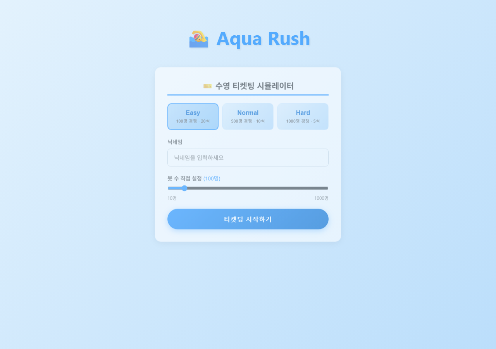
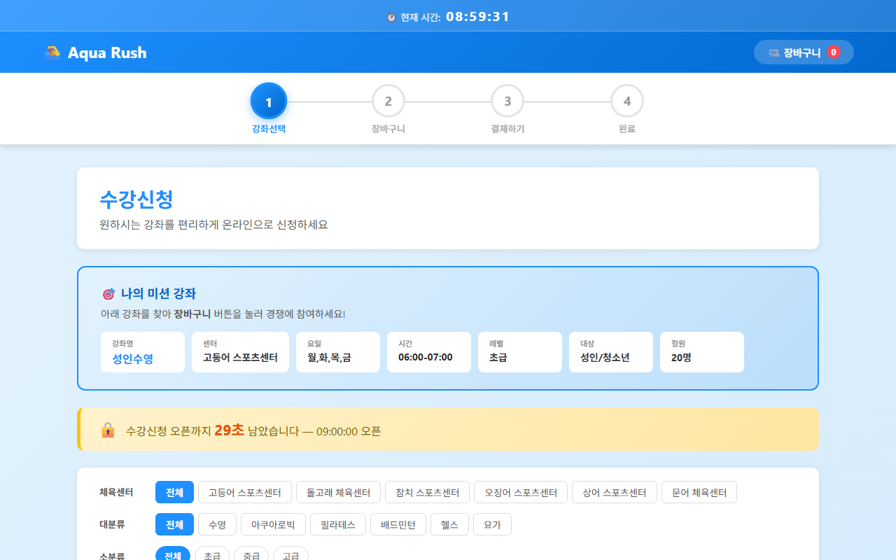
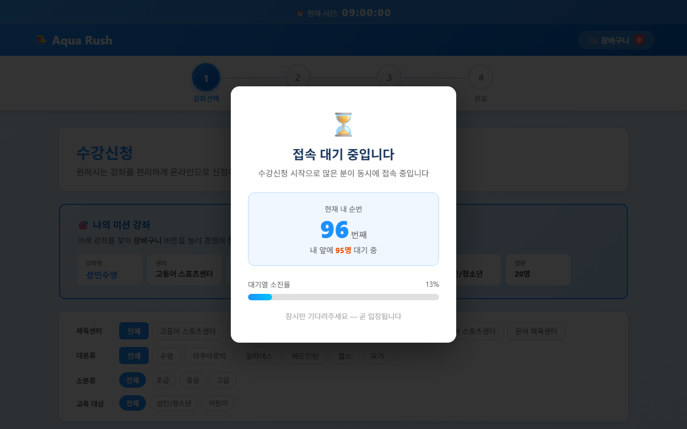
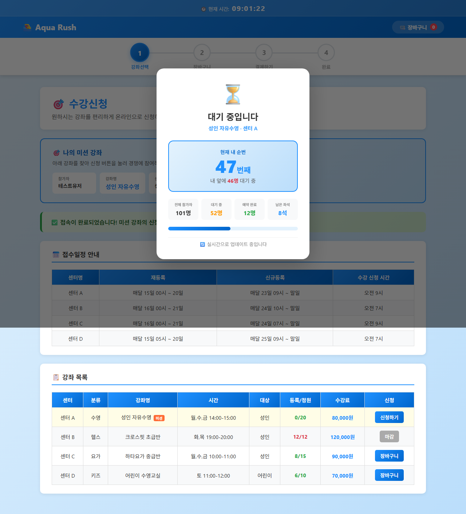
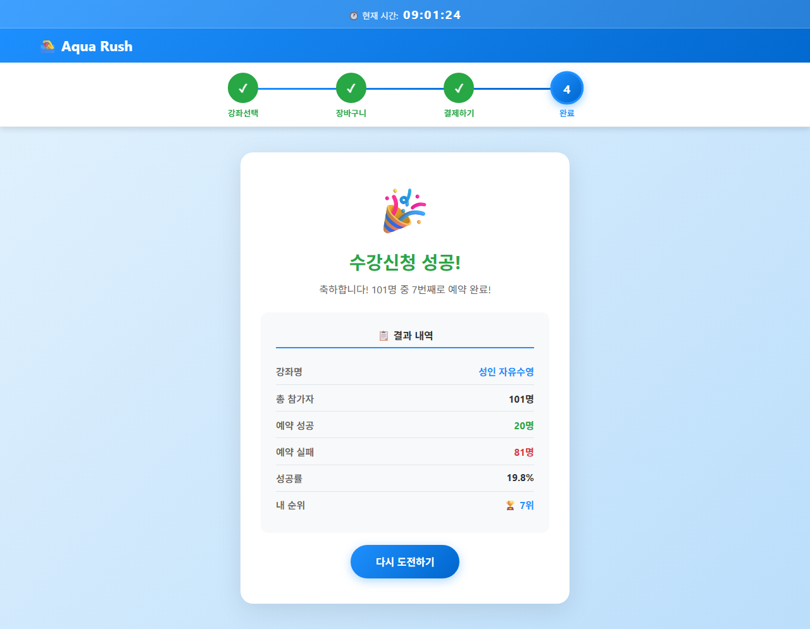
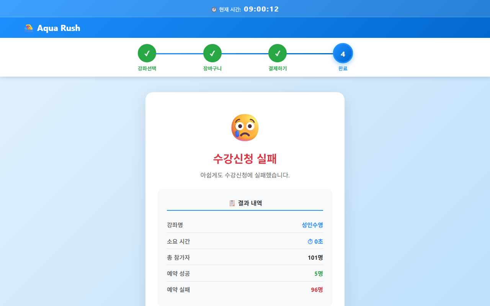

# 🏊 Aqua Rush — 수켓팅 시뮬레이터

### 티켓팅보다 어려운 수켓팅, 'Aqua Rush'로 연습하고 행수하는 그날까지!

> **수켓팅(수영 티켓팅)** 경쟁 환경을 직접 체험하는 시뮬레이션 시스템  
> 분산 락 · 유량제어 · Redis 대기열 · SSE 실시간 통신 · 멀티스레드 동시성 제어

[](https://openjdk.org/projects/jdk/17/)
[](https://spring.io/projects/spring-boot)
[](https://react.dev/)
[](https://redis.io/)

---

## 프로젝트 개요

최근 수영의 인기가 크게 높아지고 있습니다.
수영장 수강신청은 매달 정해진 시간에 수백 명이 동시에 몰리게 됩니다.  
**Aqua Rush**는 이러한 경쟁 시스템 상황을 그대로 재현합니다.

- 사용자는 닉네임과 경쟁 난이도(봇 수)를 설정하고 시뮬레이션에 참가
- 수강신청 시간이 되면 설정한 수의 봇이 자동으로 예약 경쟁을 시작
- 사용자는 F5로 새로고침하여 접속 대기열을 통과하고 신청 버튼을 눌러 경쟁에 참여
- 결과(내 순위 / 성공 여부 / 전체 통계)를 실시간으로 확인

---

## 스크린샷

| 시작 페이지 | 수강신청 (카운트다운) |
|---|---|
|  |  |

| 접속 유량제어 (새로고침 시) | 예약 대기열 (실시간) |
|---|---|
|  |  |

| 결과 — 성공 | 결과 — 실패 |
|---|---|
|  |  |

---

## 기술 스택

| 분류 | 기술 |
|---|---|
| **Backend** | Java 17, Spring Boot 3.5.6 |
| **Database** | MySQL (JPA + Hibernate) |
| **Cache / Queue** | Redis, Redisson 3.24.3 |
| **Frontend** | React 19, Vite 8, React Router v7 |
| **HTTP Client** | Axios |
| **실시간 통신** | SSE (Server-Sent Events) |
| **API 문서** | SpringDoc OpenAPI (Swagger) |
| **Infrastructure** | Docker Compose |

---

## 핵심 기술 상세

### 1. 이중 동시성 제어 — 정원 초과 완벽 차단

실제 티켓팅 시스템의 핵심 문제인 **race condition**을 두 단계로 막습니다.

```
예약 요청
  └─ Redisson 분산 락 (여러 서버 간 동시성)
       └─ DB SELECT FOR UPDATE (단일 트랜잭션 내 동시성)
            └─ 중복 예약 확인 → 정원 확인 → 예약 저장
```

- **Redisson 분산 락**: 여러 서버 인스턴스가 동시에 같은 강좌를 처리할 때 발생하는 동시성 문제 해결
- **비관적 락(SELECT FOR UPDATE)**: 같은 서버 내에서 동시 트랜잭션 간 정원 증감의 원자성 보장
- 1000명이 동시에 정원 20석에 요청해도 **단 한 건도 초과 예약되지 않음**

### 2. Redis Sorted Set 대기열 — 공정한 순서 보장

```
사용자 진입 → enterQueue(sessionId, courseId)
               └─ ZADD queue:course:{id} {timestamp} {sessionId}

예약 시도 시 → checkQueueAllowed()
               └─ ZRANK 조회 → 상위 10명 이내면 통과, 초과면 "대기 중" 예외

예약 완료 후 → removeFromQueue()
               └─ ZREM → 뒤 사람 순번 자동 앞당김
```

- Score에 진입 시간(timestamp)을 사용해 **선착순 공정성** 보장
- BotService의 재시도 로직(2초 간격, 최대 5회)이 대기열 처리를 자연스럽게 시뮬레이션

### 3. SSE 실시간 스트림 — 경쟁 현황 1초 단위 업데이트

```
SimulationScheduler (1초마다)
  └─ Redis Hash 조회: simulation:{id} → {successCount, failCount, ...}
  └─ WaitingQueueService → queueLength, myRank
  └─ ReservationRepository → remainingSeats
  └─ SseEmitter.send(SimulationStatusResponse)
       └─ 프론트엔드 EventSource 수신 → 실시간 UI 업데이트
```

- 봇 1개 완료 시마다 `HINCRBY`로 즉시 Redis 카운터 증가 → SSE로 실시간 반영
- 프론트엔드는 SSE + 1.5초 폴링 이중 구조로 race condition(봇 선완료) 대비

### 4. 멀티스레드 봇 시뮬레이션

```java
ExecutorService executor = Executors.newFixedThreadPool(Math.min(botCount, 100));
CountDownLatch latch = new CountDownLatch(bots.size());

// 각 봇: 재시도 전략 적용
tryReservationWithRetry(courseId, bot, attempts, stopFlag)
  ├─ 성공 → HINCRBY successCount +1
  ├─ 정원 초과 → 즉시 포기 (재시도 없음)
  ├─ 대기열 순번 초과 → 2초 후 재시도 (최대 5회)
  └─ 예외 → HINCRBY failCount +1
```

- ThreadPool 크기: `min(봇 수, 100)` — 과도한 스레드 생성 방지
- `AtomicBoolean stopFlag`로 `/stop` API 호출 시 모든 봇 스레드 안전 종료 (최대 2초)
- `CountDownLatch`로 모든 봇 완료 대기 후 자원 정리

### 5. 유량제어 (Rate Limiting)

- **Redis Sorted Set 기반 슬라이딩 윈도우** — 요청 시각(ms)을 score로 저장, 항상 "지금 기준 과거 60초"를 동적 계산
- Lua 스크립트로 `ZREMRANGEBYSCORE` → `ZCARD` → `ZADD` 원자 처리 — race condition 방지
- 고정 윈도우 카운터 대비 경계 뚫기(boundary attack) 차단
- 기본 제한: 5회/분 (`/api/**` 전체 적용)
- SSE 스트림 및 상태 조회 엔드포인트는 제외 (지속 연결 특성상)
- 초과 시 HTTP 429 + `X-RateLimit-Remaining`, `X-RateLimit-Reset` 헤더 응답

### 6. 프론트엔드 UX — 실제 수강신청 사이트 재현

- **`openOnMount` 패턴**: 컴포넌트 마운트 시점 기준으로 "9시 이후 새로고침"과 "같은 세션에서 9시 도달"을 구분
- **접속 유량제어 오버레이**: 새로고침 시 500~2500 순번에서 0까지 5초 카운트다운 — 실제 대학교/공공기관 수강신청 사이트의 대기 팝업 재현
- **자동 봇 시작**: 9시가 되는 순간 `startSimulation` 자동 호출 — 버튼 클릭 불필요
- **버튼 활성화 조건**: 9시 이후 + 새로고침 + 유량제어 통과의 3단계를 모두 만족해야 활성화

---

## 프로젝트 구조

```
AquaRush/
├── backend/
│   └── ticketing/
│       └── src/main/java/com/aquarush/ticketing/
│           ├── category/       강좌 카테고리
│           ├── center/         수영장/센터
│           ├── course/         강좌 (비관적 락)
│           ├── reservation/    예약 (분산 락 + 비관적 락)
│           ├── simulation/     시뮬레이션 엔진, 봇, SSE
│           ├── waitingqueue/   Redis Sorted Set 대기열
│           ├── lock/           Redisson 분산 락 유틸
│           ├── ratelimit/      유량제어 인터셉터
│           └── global/         설정 (Redis, Web, Async, Swagger)
│
├── frontend/
│   └── src/
│       ├── pages/              StartPage, RegistrationPage, ResultPage, CartPage, CheckoutPage
│       ├── components/         AquaHeader, QueueModal, AccessQueueOverlay, StatCard, QueueBar
│       ├── hooks/              useVirtualClock
│       └── api/                simulation.js (API 클라이언트)
│
└── docker-compose.yml          Redis + Redis Commander
```

---

## API 엔드포인트

### 시뮬레이션
```
POST   /api/v1/simulation/start          시뮬레이션 시작 (봇 생성 및 경쟁 시작)
GET    /api/v1/simulation/status/{id}    현황 조회
GET    /api/v1/simulation/live/{id}      실시간 SSE 스트림
POST   /api/v1/simulation/stop           시뮬레이션 중단
```

### 예약
```
POST   /api/v1/reservations              예약 생성 (분산 락 적용)
GET    /api/v1/reservations/{id}         예약 상세
GET    /api/v1/reservations/my           내 예약 목록
DELETE /api/v1/reservations/{id}         예약 취소
```

### 강좌
```
GET    /api/v1/courses/{id}              강좌 상세
GET    /api/v1/courses/search            강좌 검색 (센터/카테고리/요일 등)
```

---

## 구현 현황

| 모듈 | 상태 |
|---|---|
| 강좌/센터/카테고리 API | ✅ 완료 |
| 예약 시스템 (이중 동시성 제어) | ✅ 완료 |
| 유량제어 (Rate Limiting) | ✅ 완료 |
| 분산 락 (Redisson) | ✅ 완료 |
| Redis 대기열 | ✅ 완료 |
| 시뮬레이션 엔진 (봇, SSE) | ✅ 완료 |
| 프론트엔드 (React) | ✅ 완료 |
| 부하 테스트 (10/100/1000명) | ✅ 완료 |

자세한 변경 이력: [`backend/ticketing/CHANGES.md`](backend/ticketing/CHANGES.md) · [`frontend/CHANGES.md`](frontend/CHANGES.md)
